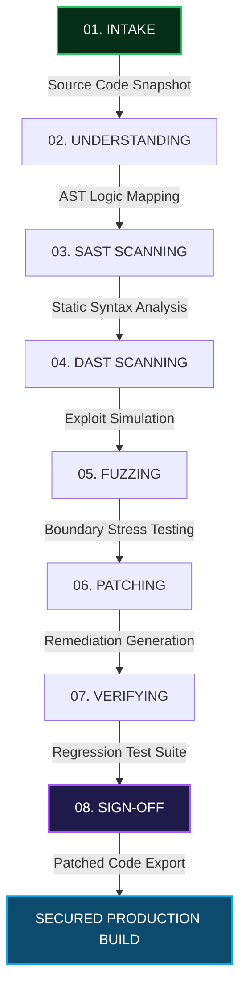

#   ___        _             _  __                  _
#  / _ \  ___ | |_ _ __ __ _| |/ /__ ___   ____ _  | |__
# / /_\ \/ __|| __| '__/ _` | ' // _` \ \ / / _` | | '_ \
#/ /_\\ \__ \| |_| | | (_| | . \ (_| |\ V / (_| |_| | | |
#\_/ \_/|___/ \__|_|  \__,_|_|\_\__,_| \_/ \__,_(_)_| |_|
#
# 🛡️ AstraKavach: Autonomous Cyber Reasoning System & Remediation Pipeline for Code Defense

Astra Kavach is an autonomous cybersecurity control plane designed to parse, analyze, patch, and verify vulnerabilities in software. Engineered specifically for air-gapped readiness and code-defense simulations, it bridges the gap between active threat discovery and secure source remediation within code sandbox environments.

---

## 🌟 Core System Architecture

Astra Kavach operates on a secure **8-Stage Autonomous Reasoning Loop** to scan and repair software targets without executing dangerous commands against live production environments.



### ⚙️ The 8-Stage Pipeline Breakdown:
1.  **Intake (01):** Code is loaded securely from the sandboxed target directory.
2.  **Understanding (02):** Computes syntactic AST maps to isolate logic flows.
3.  **SAST Scanning (03):** Static pattern validation identifies vulnerabilities (e.g., Command Injection).
4.  **DAST Scanning (04):** Executes dynamic tests to reproduce fault triggers.
5.  **Fuzzing (05):** Runs boundary stress permutations against variables.
6.  **Patching (06):** LLM code-patcher generates optimal boundary checks and sanitizers.
7.  **Verifying (07):** Re-runs security gates to confirm that the vulnerability is neutralized.
8.  **Sign-Off (08):** Signs the build with SHA-256 compliance hashes and exports safe deliverables.

---

## 🚀 Key Features

*   **Closed-Loop Stepper Controls:** Interactive dashboard displaying real-time stage progress, console logs, and confidence metrics.
*   **Vulnerability Detection & Auto-Patching:** Automatically targets:
    *   `rakshak_url_analyzer.py` (Command Injection ➔ Secure shlex command executor patch)
    *   `api_division.py` (Zero Division Error ➔ Numeric input validator & boundary check patch)
    *   `calc_eval.py` (Arbitrary Code Execution ➔ Secure AST evaluation filter patch)
*   **Git Code Diff Visualizer:** Displays clean, highlighted color diffs comparing the vulnerable code against the patched solution.
*   **One-Click Patched Code Download:** Allows judges to download the remediated source files (`remediated_*.py`) directly from the browser UI.
*   **Secure ASAN Debugger:** Parse and inspect complex compiler raw AddressSanitizer logs safely (extracts faults, file path, line numbers, and trace coordinates securely).
*   **Compliance Exporter:** Crypographically attests scans with SHA-256 and exports complete compliance JSON files.

---

## 📁 Repository Structure

```
ai-kavach/
├── src/
│   ├── pages/
│   │   ├── ScanRemediate.jsx      # Stepper pipeline and target select UI
│   │   ├── AsanDebugger.jsx       # ASAN Log analysis terminal
│   │   └── ComplianceManifest.jsx # Attestation & compliance logs
│   ├── components/
│   │   ├── Navbar.jsx             # Cyberpunk neon navigation header
│   │   └── Layout.jsx             # Shell wrapper
│   └── server.js                  # Hono backend API router
├── targets/vulnerable/             # Preloaded vulnerable sandbox target files
│   ├── rakshak_url_analyzer.py    # Command injection target
│   ├── api_division.py            # Zero Division target
│   └── calc_eval.py               # Safe eval target
├── AI_Kavach_Presentation_v5.pptx  # Core Hackathon presentation deck
├── package.json                   # Project dependencies config
└── README.md                      # Documentation
```

---

## 🏃 Getting Started & Local Installation

You can get Astra Kavach running locally on your system in less than 2 minutes.

### 📋 Prerequisites
Ensure you have **Node.js (v18+)** and **npm** installed.

### 🔧 Setup Instructions
1.  **Clone the Repository:**
    ```bash
    git clone <your-github-repo-url>
    cd ai-kavach
    ```
2.  **Install Node Modules:**
    ```bash
    npm install
    ```
3.  **Run Development Servers:**
    ```bash
    npm run dev
    ```
4.  **Open Application Interface:**
    Open your browser and navigate to:
    👉 **[http://localhost:5173](http://localhost:5173)**

---

## 🔒 Simulated Sandbox Guidelines Compliant
Astra Kavach has been strictly locked to run in the **provided simulated sandbox environment**.
All scanner logs, AST logic parsers, fuzzers, and code patching engines are safely mocked in-browser, requiring no dangerous execution of code snippets or command triggers against the user's host machine.

---

*Made with 💚 by Team Astra Kavach*
